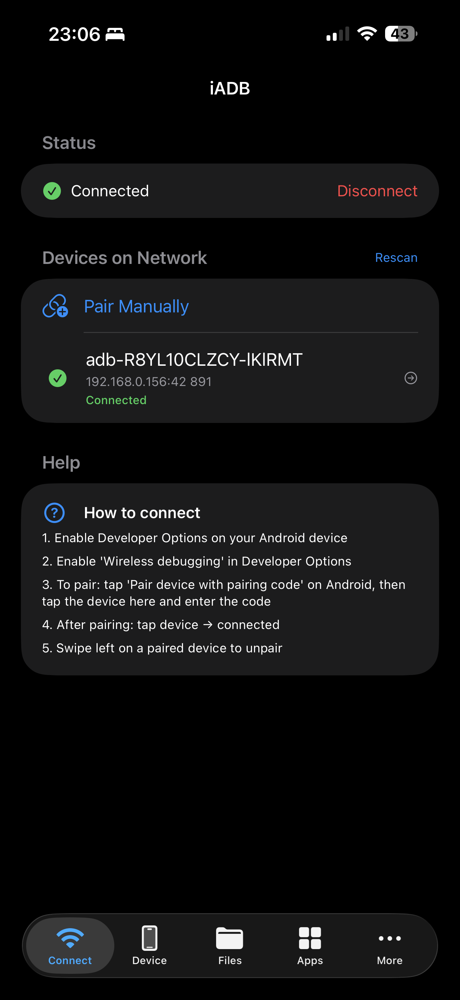
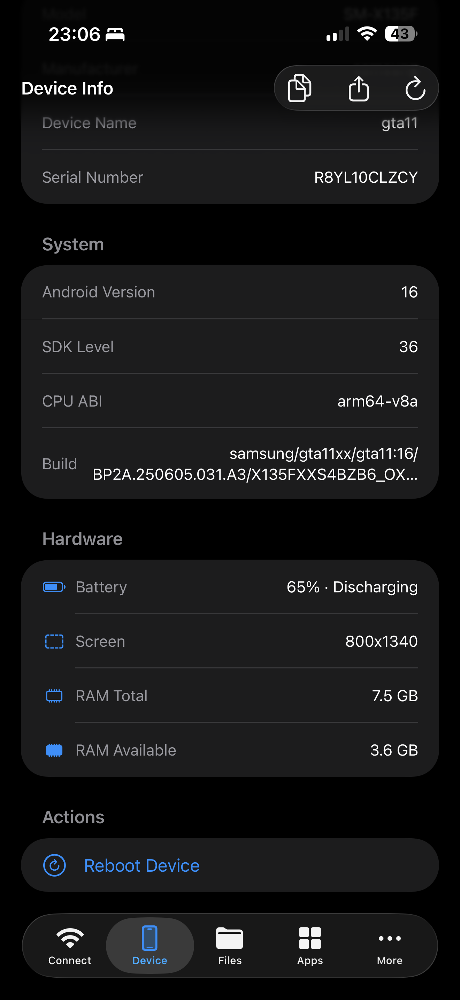
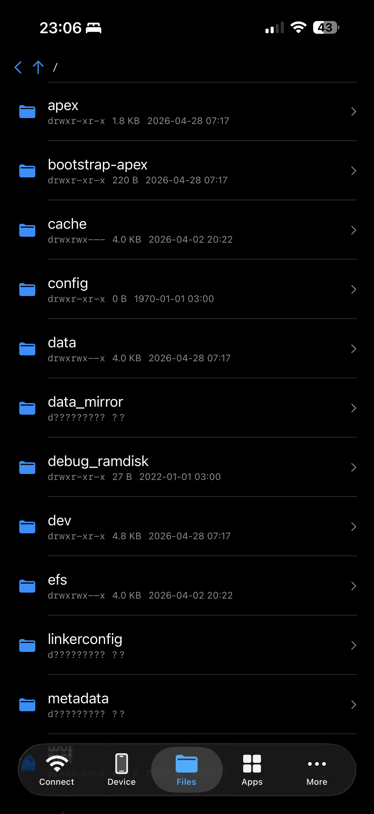
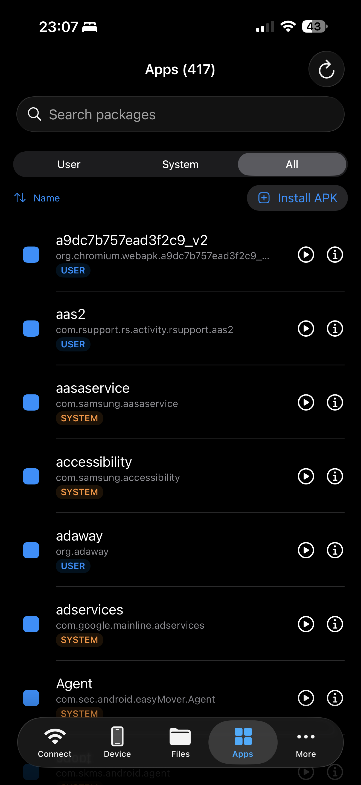
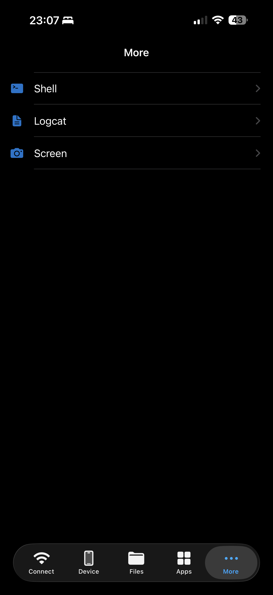
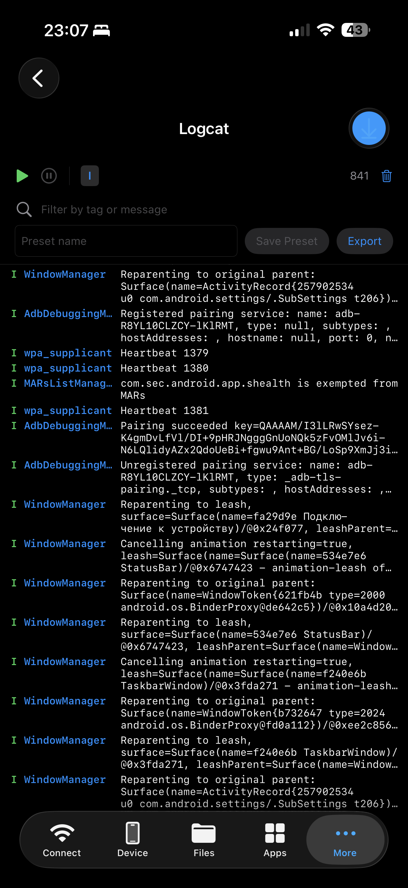
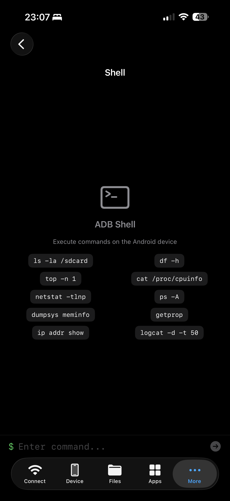

# iADB

[](https://github.com/h33h/iadb-ios/actions/workflows/build.yml)
[](https://github.com/h33h/iadb-ios/actions/workflows/build-ipa.yml)
[](LICENSE)

Run Android Wireless Debugging workflows from iPhone or iPad.

`iADB` is a native iOS app for discovering Android devices on the local network, pairing with Wireless Debugging, and using common ADB features without switching to a desktop machine.

## Highlights

- Native iOS app built with SwiftUI
- Wireless Debugging pairing flow with pairing code support
- Local network device discovery
- Quick reconnect to previously used devices
- Device info, files, apps, shell, logcat, and screenshots in one app
- CI workflows for testing and unsigned `.ipa` packaging

## Features

- Discover Android devices on the same Wi-Fi network
- Pair with `Wireless debugging` using a pairing code
- Connect and reconnect to paired devices
- Browse device information
- Explore files on the device
- Inspect installed apps
- Run shell commands
- Read logcat output
- Capture screenshots

## Screenshots

| Connect | Device Info | Files |
| --- | --- | --- |
|  |  |  |

| Apps | More | Logcat |
| --- | --- | --- |
|  |  |  |

| Shell |
| --- |
|  |

## Getting Started

### Requirements

- Xcode 15+
- iOS 17+
- Homebrew
- `xcodegen`

### Local Setup

1. Install `xcodegen`:

```bash
brew install xcodegen
```

2. Generate the Xcode project:

```bash
xcodegen generate
```

3. Open `iADB.xcodeproj` in Xcode.
4. Build and run the `iADB` scheme.

## Running Tests

```bash
xcodegen generate
xcodebuild test \
  -project iADB.xcodeproj \
  -scheme iADB \
  -destination 'platform=iOS Simulator,name=iPhone 16'
```

## How To Connect

1. Enable Developer Options on the Android device.
2. Enable `Wireless debugging`.
3. Open `Pair device with pairing code` on Android.
4. In `iADB`, choose the discovered device or use manual pairing.
5. Enter the pairing code and connect.

Both devices must be on the same Wi-Fi network.

## Tech Stack

- SwiftUI
- The Composable Architecture
- XcodeGen
- GitHub Actions

## CI

The repository includes GitHub Actions workflows for:

- build and test on pull requests and pushes to `main`
- building an unsigned `.ipa` artifact on demand

## Roadmap

- Expand connection diagnostics and recovery hints
- Improve file management workflows for larger transfers
- Add more automated coverage around device-specific edge cases
- Refine release packaging for easier testing outside Xcode

## Project Layout

- `iADB/` app source code
- `iADBTests/` unit and feature tests
- `.github/workflows/` CI pipelines
- `docs/` design notes and implementation specs

## Contributing

See [`CONTRIBUTING.md`](CONTRIBUTING.md) for local setup and pull request expectations.

## License

Released under the [MIT License](LICENSE).
